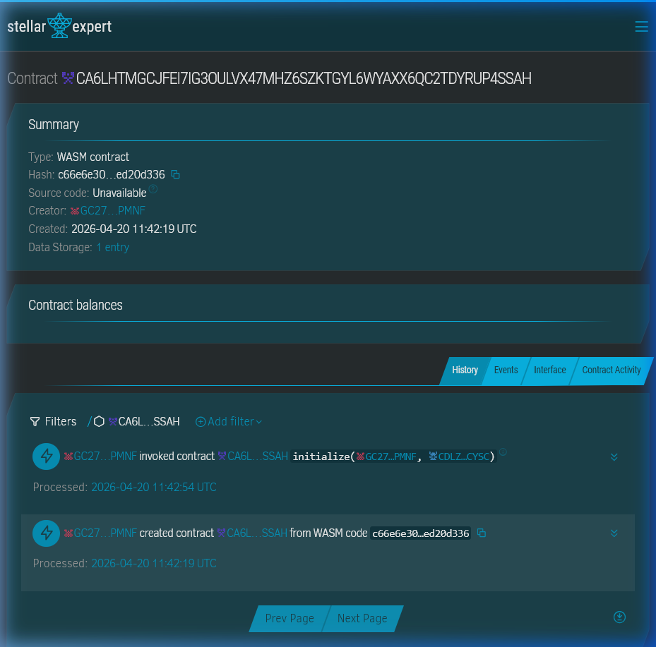

# PasaBuy 🛍️

> Trustless cross-border escrow for informal pasabuy transactions on Stellar.

---

## 🚀 Deployed Smart Contract

| | |
|---|---|
| **Contract ID** | `CA6LHTMGCJFEI7IG3OULVX47MHZ6SZKTGYL6WYAXX6QC2TDYRUP4SSAH` |
| **Network** | Stellar Testnet |
| **Stellar Expert** | [View on Stellar Expert](https://stellar.expert/explorer/testnet/contract/CA6LHTMGCJFEI7IG3OULVX47MHZ6SZKTGYL6WYAXX6QC2TDYRUP4SSAH) |
| **Stellar Lab** | [View on Stellar Lab](https://lab.stellar.org/r/testnet/contract/CA6LHTMGCJFEI7IG3OULVX47MHZ6SZKTGYL6WYAXX6QC2TDYRUP4SSAH) |

### Screenshot of Deployed Contract



---

## 🌐 Live Demo

**Frontend**: [https://pasa-buy.vercel.app/](https://pasa-buy.vercel.app/)

---

## What is PasaBuy?

**Pasabuy** is a deeply Filipino practice — asking a friend, relative, or stranger abroad to buy something on your behalf and bring it home. It's informal, it's common, and it's risky. Money changes hands with no guarantees, no recourse, and no paper trail.

PasaBuy fixes that. It's a Soroban-powered escrow dApp that locks a buyer's funds when they post a request, assigns an agent abroad to fulfill it, and only releases payment when the buyer confirms delivery. Disputes are handled on-chain with an admin resolution path.

No middlemen. No trust required. Just code.

---

## The Problem

A Filipino buyer wants a limited item — Nike shoes from Japan, a skincare brand from Korea, a gadget not sold locally. They find an agent on Facebook or Reddit willing to buy it abroad for a service fee. But there's no trustless way to send money:

- The buyer sends money upfront and hopes for the best
- The agent ships first and hopes the buyer pays
- Either side can ghost with no recourse

This informal economy is worth millions annually among OFWs and Filipino online shoppers — and it runs entirely on blind trust.

---

## The Solution

PasaBuy puts the escrow on Stellar.

1. **Buyer posts an order** — XLM is locked in a Soroban smart contract
2. **Agent accepts** — commits to buying and shipping the item
3. **Agent marks shipped** — buyer is notified
4. **Buyer confirms delivery** — XLM is released to the agent
5. **Dispute?** — funds freeze, admin resolves on-chain

Stellar's near-zero fees make this practical for everyday ₱500–₱5,000 transactions that would be eaten alive by Ethereum gas costs.

---

## Off-Chain Communication

While the escrow, fund locking, and dispute resolution happen trustlessly on-chain, **communication happens where users already are**. 

The "Item Name" stored on-chain (max 9 characters) acts as a short reference code (e.g., `NikeAJ1`). Buyers and Agents use social platforms like **Facebook, Messenger, WhatsApp, or Reddit** to discuss specific details, share Amazon links, agree on sizes, and provide shipping updates. PasaBuy acts solely as the secure financial layer for these existing interactions.

---

## Stellar Features Used

| Feature | Purpose |
|---|---|
| Soroban smart contracts | Escrow state machine, dispute logic |
| Native XLM | Escrow payment currency & transaction fees |
| Trustlines | For custom assets (if expanded beyond XLM) |

---

## Contract Functions

| Function | Description |
|---|---|
| `initialize(admin, token)` | Set contract admin and the token to be used for escrow |
| `create_order(...)` | Buyer locks XLM, creates order |
| `accept_order(agent, order_id)` | Agent commits to fulfilling the order |
| `mark_shipped(agent, order_id)` | Agent marks item as shipped |
| `confirm_delivery(buyer, order_id)` | Buyer confirms receipt, releases XLM |
| `dispute(buyer, order_id)` | Buyer freezes funds pending resolution |
| `resolve_dispute(admin, order_id, refund_buyer)` | Admin sends funds to buyer or agent |
| `get_order(order_id)` | Read order state |
| `order_count()` | Total orders created |

---

## Order State Machine

```
Open → Accepted → Shipped → Completed
                          ↘ Disputed → Resolved
```

---

## Prerequisites

- [Rust](https://rustup.rs/) with Wasm target:
  ```bash
  rustup target add wasm32-unknown-unknown
  ```
- Stellar CLI v26+:
  ```bash
  cargo install --locked stellar-cli --features opt
  ```

---

## Build

```bash
stellar contract build
```

Output: `target/wasm32-unknown-unknown/release/pasabuy.wasm`

---

## Test

```bash
cargo test
```

Expected output:
```
running 5 tests
test test::tests::test_full_order_lifecycle ... ok
test test::tests::test_cannot_accept_already_accepted_order - should panic ... ok
test test::tests::test_storage_state_after_create_order ... ok
test test::tests::test_buyer_can_dispute_after_shipment ... ok
test test::tests::test_admin_resolves_dispute_with_refund ... ok
test result: ok. 5 passed; 0 failed
```

---

## Deploy to Testnet

**Generate and fund a key:**
```bash
stellar keys generate pasabuy-deployer --network testnet
stellar keys address pasabuy-deployer
```

**Deploy:**
```bash
stellar contract deploy \
  --wasm target/wasm32-unknown-unknown/release/pasabuy.wasm \
  --source-account pasabuy-deployer \
  --network testnet
```

Save the returned `CONTRACT_ID`.

**Currently deployed contract:** `CA6LHTMGCJFEI7IG3OULVX47MHZ6SZKTGYL6WYAXX6QC2TDYRUP4SSAH`

---

## Sample CLI Invocations

**Initialize:**
```bash
stellar contract invoke \
  --id CA6LHTMGCJFEI7IG3OULVX47MHZ6SZKTGYL6WYAXX6QC2TDYRUP4SSAH \
  --source-account pasabuy-deployer \
  --network testnet \
  -- initialize \
  --admin $(stellar keys address pasabuy-deployer) \
  --token_id CDLZFC3SYJYDZT7K67VZ75HPJVIEUVNIXF47ZG2FB2RMQQVU2HHGCYSC
```

**Buyer creates an order (100 XLM):**
```bash
stellar contract invoke \
  --id <CONTRACT_ID> \
  --source-account pasabuy-deployer \
  --network testnet \
  -- create_order \
  --buyer <BUYER_ADDRESS> \
  --amount 1000000000 \
  --service_fee 100000000 \
  --item_description NikeAJ1
```

**Agent accepts:**
```bash
stellar contract invoke \
  --id <CONTRACT_ID> \
  --source-account pasabuy-deployer \
  --network testnet \
  -- accept_order \
  --agent <AGENT_ADDRESS> \
  --order_id 1
```

**Agent marks shipped:**
```bash
stellar contract invoke \
  --id <CONTRACT_ID> \
  --source-account pasabuy-deployer \
  --network testnet \
  -- mark_shipped \
  --agent <AGENT_ADDRESS> \
  --order_id 1
```

**Buyer confirms delivery:**
```bash
stellar contract invoke \
  --id <CONTRACT_ID> \
  --source-account pasabuy-deployer \
  --network testnet \
  -- confirm_delivery \
  --buyer <BUYER_ADDRESS> \
  --order_id 1
```

**Buyer raises a dispute:**
```bash
stellar contract invoke \
  --id <CONTRACT_ID> \
  --source-account pasabuy-deployer \
  --network testnet \
  -- dispute \
  --buyer <BUYER_ADDRESS> \
  --order_id 1
```

**Admin resolves dispute (refund buyer):**
```bash
stellar contract invoke \
  --id <CONTRACT_ID> \
  --source-account pasabuy-deployer \
  --network testnet \
  -- resolve_dispute \
  --admin <ADMIN_ADDRESS> \
  --order_id 1 \
  --refund_buyer true
```

**Read order state:**
```bash
stellar contract invoke \
  --id <CONTRACT_ID> \
  --network testnet \
  -- get_order \
  --order_id 1
```

---

## Project Structure

```
PasaBuy/
├── contract/
│   ├── src/
│   │   ├── lib.rs        # Soroban smart contract
│   │   └── test.rs       # 5 contract tests
│   └── Cargo.toml
├── frontend/
│   ├── src/            # Vite frontend logic (JS/Vanilla CSS)
│   ├── index.html      # UI entrypoint
│   └── package.json
└── README.md
```

---

## Run the Web App

The project includes a robust Vite-based frontend connecting directly to the Soroban contract:
```bash
cd frontend
npm install
npm run dev
```

---

## Vision

PasaBuy makes the existing informal pasabuy economy — already worth millions annually among OFWs and Filipino shoppers — trustless, auditable, and accessible to anyone with a Stellar wallet. Every pasabuy transaction that moves on-chain is a step toward a fairer, verifiable cross-border commerce layer for Southeast Asia.

---

## Built With

- [Stellar](https://stellar.org/)
- [Soroban](https://soroban.stellar.org/)
- [soroban-sdk](https://docs.rs/soroban-sdk)
- [Rust](https://www.rust-lang.org/)

---

## Region

🇵🇭 Philippines — Southeast Asia

---

## License

MIT © 2025 PasaBuy